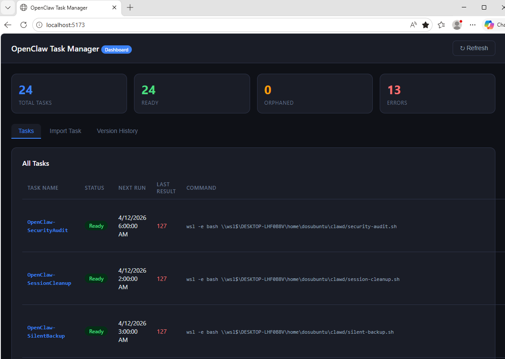

# OpenClaw Task Manager

Manage Windows Task Scheduler tasks for OpenClaw agents from a browser or the command line. Enforces naming conventions, tracks all tasks in a registry, and provides version history with restore capability.



## Features

- **Web Dashboard** — Browser-based task management at `http://localhost:5173`
- **Naming Convention Enforcement** — All tasks must follow `OpenClaw_{Project}_{Action}_{Schedule}`
- **Task Registry** — Tracks all managed tasks in `~/.openclaw/task-registry.json`
- **Version History** — Every task change is versioned, with full restore capability
- **Import Existing Tasks** — Register tasks created outside this tool
- **Orphan Detection** — Highlights tasks in Windows that aren't in the registry
- **CLI Scripts** — Full command-line interface for create, list, status, delete, and import

## Requirements

- Windows 10/11 with `schtasks.exe`
- WSL2 with OpenClaw installed (for WSL-side execution)
- Python 3.6+ with Flask

## Quick Start

### 1. Start the Dashboard

**Option A — Automatic (Windows):**
```powershell
# From the openclaw-task-manager directory
start-dashboard.bat
```

**Option B — Manual (WSL):**
```bash
cd ~/clawd/projects/openclaw-task-manager/dashboard
python dashboard.py
```

Then open **http://localhost:5173** in your browser.

### 2. Create a Task

From the dashboard, use the **Create Task** tab. Or via CLI:

```bash
python scripts/create.py OpenClaw_ProphecyNews_NewsFull_0700 \
  "python D:\scripts\fetch_news.py" \
  --time 07:00 --daily
```

### 3. List Tasks

```bash
python scripts/list.py
```

## Naming Convention

All tasks must follow this pattern:

```
OpenClaw_{Project}_{Action}_{Schedule}
```

| Component | Example |
|-----------|---------|
| Project | `ProphecyNews`, `QuantumHub`, `LemonParty` |
| Action | `NewsFull`, `SyncDaily`, `BackupWeekly` |
| Schedule | `0700`, `Sunday`, `Daily` |

**Valid examples:**
- `OpenClaw_ProphecyNews_NewsFull_0700`
- `OpenClaw_QuantumHub_ThreatCheck_Hourly`
- `OpenClaw_LemonParty_Report_Monday`

## Dashboard Tabs

| Tab | Purpose |
|-----|---------|
| **Tasks** | View all tasks, enable/disable/run/delete |
| **Import Task** | Register an existing Windows Task Scheduler task |
| **Version History** | View and restore task configurations |

## CLI Scripts

| Script | Description |
|--------|-------------|
| `scripts/create.py` | Create a new task with registry auto-registration |
| `scripts/delete.py` | Delete a task with registry verification |
| `scripts/import.py` | Import an existing Windows task into the registry |
| `scripts/list.py` | List all registered tasks |
| `scripts/status.py` | Show detailed status for a specific task |
| `scripts/registry.py` | Registry utilities (show, export, import, clean, restore) |

## Why Not WSL Cron?

**WSL cron is fundamentally broken for background tasks.** WSL shuts down when idle, cron dies with it, and Windows can't see or manage WSL tasks. This tool uses Windows Task Scheduler (`schtasks.exe`) directly — tasks run reliably regardless of WSL state.

See `references/WSL_CRON_WARNING.md` for the full explanation.

## Installation

```bash
npx clawhub@latest install openclaw-task-manager
```

Or clone and install manually:

```bash
git clone <repo-url>
cd openclaw-task-manager/dashboard
pip install -r requirements.txt
python dashboard.py
```

## File Structure

```
openclaw-task-manager/
├── README.md
├── SKILL.md                    # OpenClaw skill documentation
├── _meta.json                  # ClawHub marketplace metadata
├── scripts/
│   ├── create.py
│   ├── delete.py
│   ├── import.py
│   ├── list.py
│   ├── registry.py
│   └── status.py
├── dashboard/
│   ├── dashboard.py            # Flask web app
│   ├── requirements.txt
│   └── templates/
│       └── index.html
├── references/
│   ├── NAMING_CONVENTION.md
│   ├── WSL_CRON_WARNING.md
│   └── SCHTASKS_REFERENCE.md
└── assets/
    └── task-template.json
```

## Examples

### Schedule a daily news fetch

```bash
python scripts/create.py OpenClaw_ProphecyNews_NewsFull_0700 \
  "python D:\scripts\fetch_news.py" \
  --time 07:00 --daily
```

### Schedule a weekly backup

```bash
python scripts/create.py OpenClaw_Backups_FullWeekly_Sunday \
  "D:\scripts\backup.bat" \
  --time 03:00 --weekly --day Sunday
```

### Import an existing task

```bash
python scripts/import.py OpenClaw_ExistingTask_Action_Schedule
```

### Restore a task to a previous version

```bash
python scripts/registry.py --restore OpenClaw_ProphecyNews_NewsFull_0700 3
```

## License

MIT
